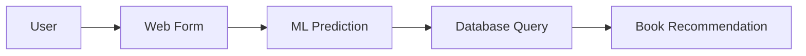

# Technical Flow of Project

## High-Level Flow


## Detailed Process Flow

### 1. User Interface Flow
- User accesses the web application
- Navigates to questionnaire form
- Answers 13 preference questions
- Receives personalized book recommendation

### 2. Route Structure
```
/ (root)
├── /form                 # Interactive questionnaire
├── /result/<book>        # Recommendation display
├── /about_project        # Project information
├── /contacts            # Contact information
└── /error               # Error handling
```

### 3. Data Processing Flow

#### Form Processing
1. User submits form data
2. Answers converted to numerical vector
3. Vector format: "12342341234" (13 digits)
4. Each digit represents user preference (1-4)

#### Recommendation Processing
1. ML model processes input vector
2. Returns book ID prediction
3. Database query retrieves book details
4. Renders recommendation page with:
   - Book title
   - Amazon purchase link

### 4. Error Handling
- Validates all questions are answered
- Redirects to error page if incomplete
- Provides user-friendly error messages

### 5. Database Interactions
- SQLite database stores book information
- Queries executed via SQLite3 Python interface
- Structured data retrieval for recommendations

### 6. Session Management
- Flask session handling
- Persistent user experience
- Secure data handling 