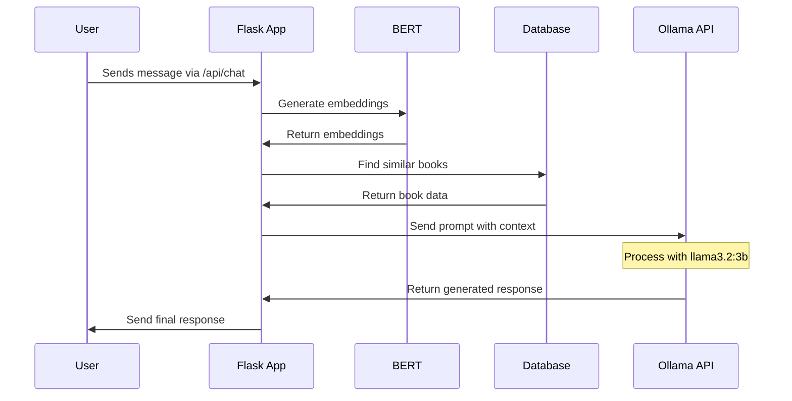

# Ollama Communication Architecture

## Overview
This document explains how the communication works between the Flask application and the Ollama LLM service in the Book Recommendation System.

## Architecture Diagram
```
Your Python App (Flask)                 Ollama Service
┌─────────────────┐                    ┌──────────────┐
│                 │   HTTP Request      │              │
│  LangChain      ├──────────────────► │  Ollama API  │
│    Client       │                    │  (llama3.2:3b)│
│                 │   HTTP Response     │              │
│                 │◄──────────────────┤ │              │
└─────────────────┘                    └──────────────┘
   Port: 5000                             Port: 11434
```

## Communication Flow


## Code Implementation

### 1. Ollama Configuration
```python
# From book_chatbot.py
self.ollama = Ollama(
    base_url=f'http://{ollama_host}:{ollama_port}',  # Usually http://localhost:11434
    model="llama3.2:3b",
    temperature=0.7,
    num_ctx=4096
)
```

### 2. HTTP Communication Example
```python
# Request to Ollama
POST http://localhost:11434/api/generate
Content-Type: application/json

{
    "model": "llama3.2:3b",
    "prompt": "[INST] As a book recommendation assistant...",
    "temperature": 0.7,
    "num_ctx": 4096
}

# Response from Ollama
{
    "response": "Based on your interest in adventure books...",
    "done": true
}
```

### 3. Error Handling
```python
try:
    response = chain.run(context=context, user_input=user_input)
except Exception as e:
    logger.error(f"Error communicating with Ollama: {e}")
    # Fallback to simpler response or error message
```

### 4. Health Check Implementation
```python
@chat_bp.route('/api/health', methods=['GET'])
def health_check():
    try:
        if not chatbot:
            raise Exception("Chatbot not initialized")
        return jsonify({'status': 'healthy', 'model': 'llama3.2:3b'}), 200
    except Exception as e:
        return jsonify({'status': 'unhealthy', 'error': str(e)}), 500
```

## Key Points

1. **Independent Services**
   - Ollama runs as a system service
   - Flask application runs in Python virtual environment
   - Services can be restarted independently

2. **Communication Protocol**
   - All communication is HTTP-based
   - LangChain handles HTTP communication details
   - Stateless communication - each request is independent

3. **Security**
   - Communication is local (localhost)
   - No external API calls required
   - Port 11434 used for Ollama
   - Port 5000 used for Flask

4. **Error Handling**
   - Health checks implemented
   - Error logging
   - Graceful degradation
   - Connection retry mechanisms

## Setup Requirements

1. **Ollama Service**
   ```bash
   # Check if Ollama is running
   curl http://localhost:11434/api/version

   # Run llama3.2:3b model
   ollama run llama3.2:3b
   ```

2. **Flask Application**
   ```bash
   # Activate virtual environment
   .\venv\Scripts\activate

   # Run Flask app
   python app_CCB.py
   ```

## Troubleshooting

1. **Check Ollama Status**
   - Verify Ollama is running
   - Confirm llama3.2:3b model is loaded
   - Check port 11434 is accessible

2. **Check Flask Application**
   - Verify virtual environment is activated
   - Confirm all dependencies are installed
   - Check port 5000 is available

3. **Common Issues**
   - Port conflicts
   - Model loading errors
   - Network connectivity
   - Memory constraints 